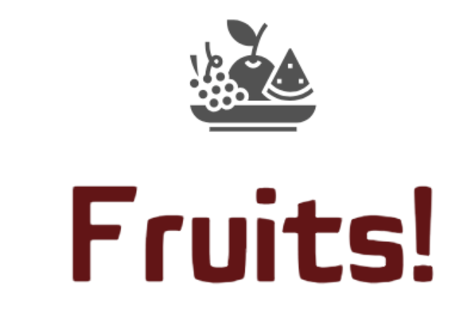

# P8-Openclassrooms-Datascientist : 
Projet 8 Openclassrooms Data science : Déployez un modèle dans le cloud

<u>*Auteur : Méric Kucukbas*</u>

## Contexte

  

Vous êtes Data Scientist dans une très jeune start-up de l'AgriTech, nommée "Fruits!", qui cherche à proposer des solutions innovantes pour la récolte des fruits. La volonté de l’entreprise est de préserver la biodiversité des fruits en permettant des traitements spécifiques pour chaque espèce de fruits en développant des robots cueilleurs intelligents.

Votre start-up souhaite dans un premier temps se faire connaître en mettant à disposition du grand public une application mobile qui permettrait aux utilisateurs de prendre en photo un fruit et d'obtenir des informations sur ce fruit.

Pour la start-up, cette application permettrait de sensibiliser le grand public à la biodiversité des fruits et de mettre en place une première version du moteur de classification des images de fruits.

De plus, le développement de l’application mobile permettra de construire une première version de l'architecture Big Data nécessaire.

## Données

Les données proviennent du Kaggle suivant : https://www.kaggle.com/datasets/moltean/fruits

Pour des raisons de côut liées à l'utilisation d'AWS, je n'ai pris qu'un sous-ensemble des données initiales pour l'étude de ce projet. Ces données sont présentes dans le fichier Kucukbas_Meric_2_data_images_250124.zip (4 catégories de fruits pour 28 variétés ~ 4904 images). Ces images se trouvent aussi sur le cloud à l'adresse suivante : [lien images cloud](https://oc8-data-mkucukba.s3.eu-west-3.amazonaws.com/data/Test1/)

## Mission 
1. S'approprier les travaux réalisés par un alternant ([lien notebook](https://s3.eu-west-1.amazonaws.com/course.oc-static.com/projects/Data_Scientist_P8/Mode_opératoire.zip))
2. Compléter la chaîne de traitement (notamment mise en place d'une réduction dimensionnelle des features avec PCA)

## Construction

Dans ce dépôt, vous trouverez :
1. Le notebook jupyter réalisé sur AWS via JupyterHub: Kucukbas_Meric_1_notebook_260124.ipynb (sur AWS : [lien notebook AWS](https://oc8-data-mkucukba.s3.eu-west-3.amazonaws.com/jupyter/jovyan/Notebook_cloud_p8fruits.ipynb)) 
2. Le fichier de résultats sous format csv: df_results_aws_emr.csv.
3. Le support de présentation : Kucukbas_Meric_3_presentation_260124.pdf .
4. Le fichier de boostrap, pour l'installation des dépendances nécessaires sur chaque noeud du cluster EMR : bootstrap-emr.sh .
5. Le dossier Kucukbas_Meric_4_resultats_250124.zip contenant les fichiers parquets regroupants la vectorisation PCA (4904 images * 138 (PCA coeffs.)). Ces fichiers se trouvent aussi sur le cloud à l'adresse suivante :  [lien résultats cloud](https://oc8-data-mkucukba.s3.eu-west-3.amazonaws.com/data/Results/).

